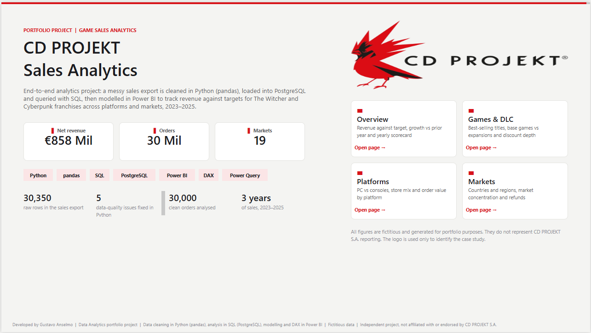
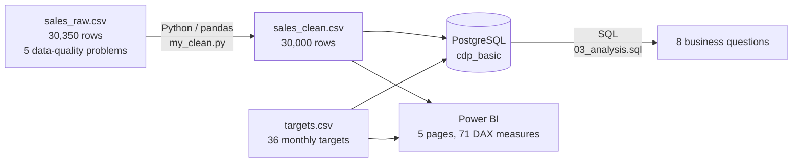
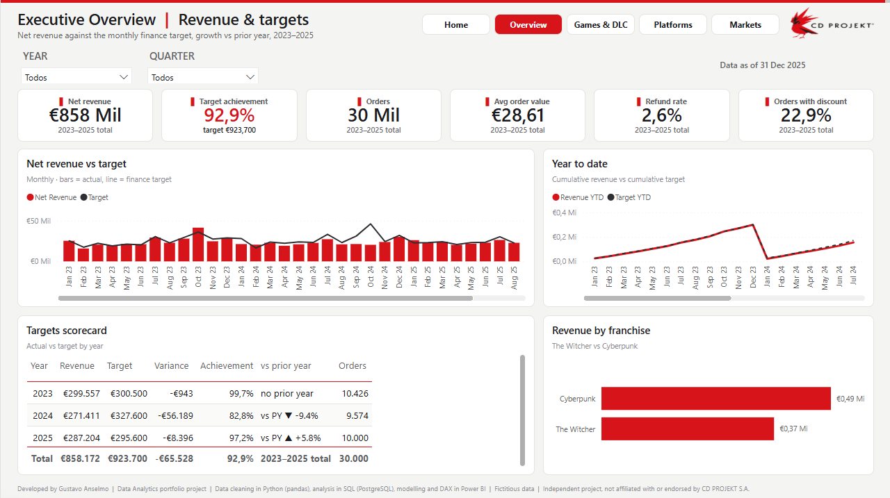
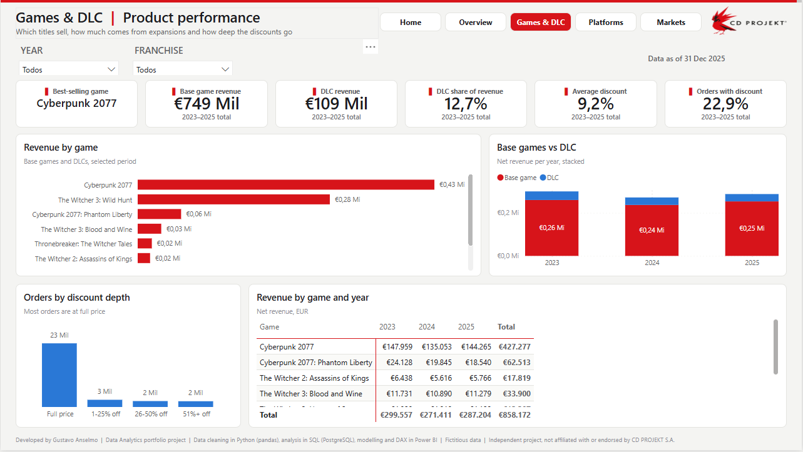
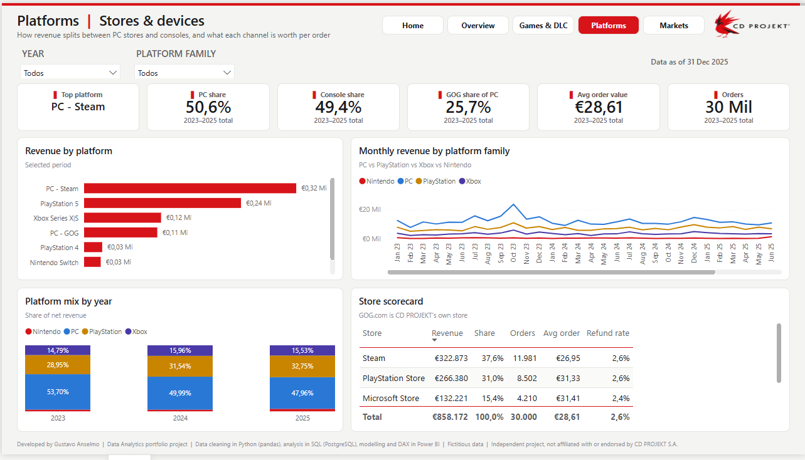
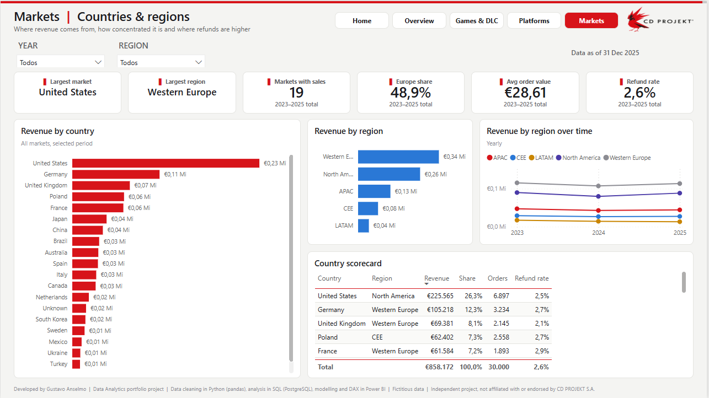

# CD PROJEKT | Game Sales Analytics with Python, PostgreSQL and Power BI

> End-to-end analytics project: a messy sales export (30,350 rows) is cleaned in **Python (pandas)**, loaded into **PostgreSQL** and analysed with **SQL**, then modelled in a 5-page **Power BI** report that tracks revenue against monthly targets for *The Witcher* and *Cyberpunk 2077* across platforms and markets, 2023–2025.

> **Disclaimer:** independent portfolio project, not affiliated with or endorsed by CD PROJEKT S.A. All figures are fictitious and generated for portfolio purposes. The CD PROJEKT logo is used only to identify the case study.



---

## At a glance

| | |
|---|---|
| **Business case** | Digital game sales of a Warsaw-based publisher, Jan 2023 to Dec 2025: 8 titles (base games and DLCs), 7 platforms, 19 markets in 5 regions |
| **Data volume** | **30,350 raw rows** in the sales export → **30,000 clean orders** · 36 monthly revenue targets |
| **Data cleaning** | **5 data-quality problems fixed in Python**: 350 duplicates, 600 empty countries, 1,500 platform names with extra spaces, 1,800 prices with a comma decimal, 1,200 refund flags written as `yes` / `no` |
| **Database** | PostgreSQL 16: `sales_clean` and `targets` tables, row count checked after loading |
| **SQL analysis** | **8 business questions** answered with `GROUP BY`, `WHERE`, `HAVING`, `CASE WHEN` and `JOIN` |
| **Power BI** | 5 pages, **71 DAX measures** (time intelligence, target achievement, vs prior year), model and report saved as code (TMDL + PBIR) |

## Stack

`Python` `pandas` `NumPy` `PostgreSQL` `SQL` `pgAdmin` `Power BI` `DAX` `Power Query` `Git`

## Architecture



## Pipeline

| Step | File | What it does |
|---|---|---|
| 1. Clean | `python/my_clean.py` | Reads the raw export, removes duplicates, fills missing countries, trims platform names, fixes comma decimals, standardises refund flags, adds `net_revenue_eur` |
| 2. Create tables | `sql/01_create_table.sql` | Creates `sales_clean` and `targets` in PostgreSQL with typed columns (`DATE`, `NUMERIC(8,2)`, `CHAR(1)`) |
| 3. Load and check | `sql/02_check_load.sql` | Imports the CSV files and checks the row count (30,000) and a sample of rows |
| 4. Analyse | `sql/03_analysis.sql` | 8 business questions (see below) |
| 5. Report | `dashboard/CDP_Sales_Analytics.pbip` | Power BI model (Calendar, targets, sales) and 5-page report |

## Highlights

### Data cleaning (Python)

| Problem in the raw export | Rows affected | Fix |
|---|---:|---|
| Duplicated rows | 350 | `drop_duplicates()` |
| Empty country | 600 | filled with `"Unknown"` |
| Extra spaces in platform names | 1,500 | `str.strip()` |
| Price with a comma decimal (`59,99`) | 1,800 | replaced with a dot, converted to `float` |
| Refund flag as `yes` / `no` instead of `Y` / `N` | 1,200 | standardised with `np.where` |

### SQL analysis (PostgreSQL)

| # | Question | SQL used |
|---|---|---|
| 1 | Revenue and orders by year | `GROUP BY`, `EXTRACT` |
| 2 | Revenue by game | `GROUP BY`, `ORDER BY ... DESC` |
| 3 | Revenue by platform in 2025 | `WHERE` |
| 4 | Top 5 countries by revenue | `WHERE`, `LIMIT` |
| 5 | Refund rate by country | `CASE WHEN`, `ROUND` |
| 6 | Markets with more than 1,000 orders | `HAVING`, `AVG` |
| 7 | Monthly revenue vs target | `JOIN`, `DATE_TRUNC` |
| 8 | Full price vs discounted orders | `CASE WHEN` + `GROUP BY` |

### Key findings

| Year | Orders | Net revenue (EUR) | vs prior year |
|---|---:|---:|---:|
| 2023 | 10,426 | 299,557 | |
| 2024 | 9,574 | 271,411 | -9.4% |
| 2025 | 10,000 | 287,204 | +5.8% |

- **2024 was the weak year**, and **October 2024 reached only 44% of target**, the biggest miss in the period.
- **Cyberpunk 2077 is the top earner** (EUR 427k) even though *The Witcher 3* has more orders: it sells at a higher price.
- **The United States is the largest market** (EUR 226k), followed by Germany and the United Kingdom.
- **Discounted orders are 23% of orders but only 15% of revenue.**

## Power BI report (5 pages)

| Page | Content |
|---|---|
| **Home** | Project summary, headline KPIs, tech stack, data-cleaning numbers, navigation |
| **Overview** | Revenue, orders, average order value and target achievement vs prior year; monthly revenue vs target; year-to-date; yearly scorecard; revenue by franchise |
| **Games & DLC** | Best-selling titles, base game vs DLC share, discount depth, game × year matrix |
| **Platforms** | PC vs consoles, platform mix by year, monthly trend by platform family, store scorecard (Steam, GOG.com, PlayStation Store...) |
| **Markets** | Revenue by country and region, Europe share, refund rate by country |

| | |
|---|---|
|  |  |
|  |  |

The report is saved in the **PBIP** format, so every measure, relationship and visual is plain text (TMDL + JSON) and versioned in Git.

## Repository structure

```
data/raw/        sales_raw.csv (messy export), targets.csv
data/clean/      sales_clean.csv (output of the Python step)
python/          my_clean.py: data cleaning
sql/             01 create tables, 02 load check, 03 business questions
dashboard/       CDP_Sales_Analytics.pbip (open in Power BI Desktop)
docs/            screenshots
```

## How to reproduce

1. `python -m venv .venv`, `.venv\Scripts\activate`, `pip install pandas numpy`
2. `python python/my_clean.py` → creates `data/clean/sales_clean.csv`
3. In PostgreSQL (pgAdmin): create the database `cdp_basic` and run `sql/01_create_table.sql`
4. Import `data/clean/sales_clean.csv` into `sales_clean` and `data/raw/targets.csv` into `targets` (CSV, header on), then run `sql/02_check_load.sql` and `sql/03_analysis.sql`
5. Open `dashboard/CDP_Sales_Analytics.pbip` in Power BI Desktop, update the `DataFolder` parameter if your path is different, and click **Refresh**

## Lessons learned

- **Check the data after every move:** the row count after loading into PostgreSQL (30,000) must match the Python output, otherwise rows were lost on the way.
- **Decimal separators break types:** prices like `59,99` are read as text. They have to be fixed before converting to a number, and Power Query reads the CSV with an `en-US` locale for the same reason.
- **SQL dialects differ:** `TOP 5` is SQL Server; PostgreSQL uses `LIMIT 5` at the end of the query.
- **Windows shows translated folder names:** the file picker showed `Documentos`, but the real path is `Documents`, so the first import failed with "No such file or directory".
- **Reports as code:** saving Power BI as PBIP instead of PBIX makes every change visible in Git.

## Next steps

- [ ] Point the Power BI model to PostgreSQL instead of the CSV files

---

Developed by **Gustavo Anselmo** | [LinkedIn](https://www.linkedin.com/in/g-anselmo/) | [GitHub](https://github.com/gustavo03anselmo-afk)
